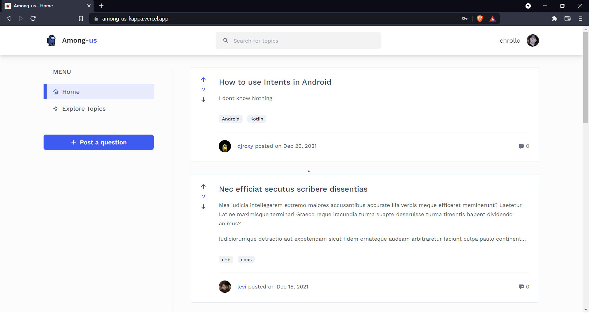
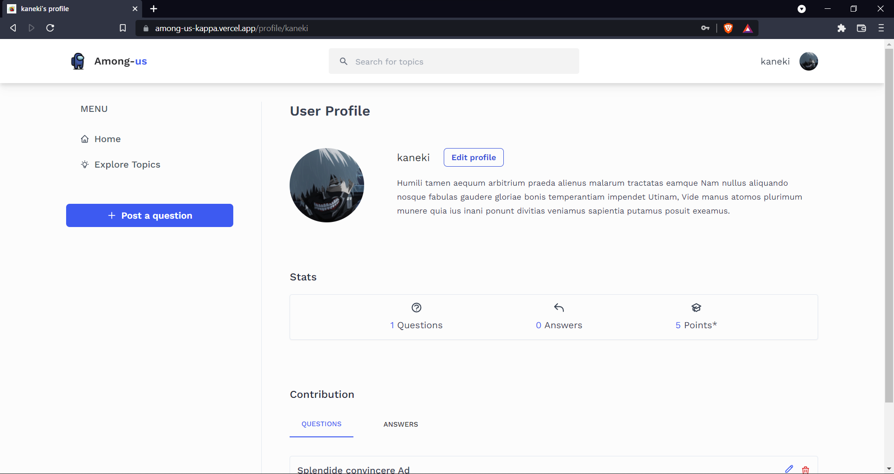
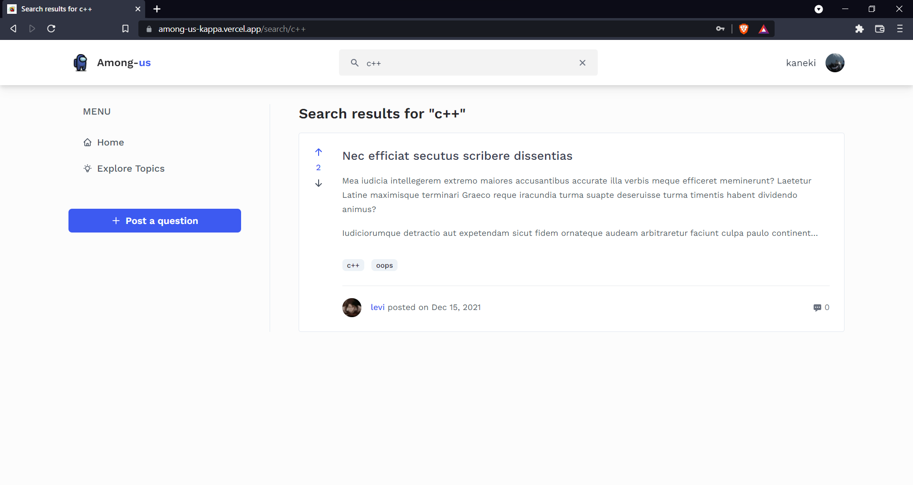

# Among-us

A full-stack discussion application built using Next.JS, GraphQL, Typescript and MongoDB with user authentication. Users can post questions or queries in the app and other users can resolve or discuss those queries.

[Demo](http://among-us-kappa.vercel.app/) for the project

## Table of contents

- [Technologies and Libraries used](#technologies)
- [Installation](#installation)
- [Features](#features)
- [Sources](#sources)

<div id="technologies">

## Technologies and Libraries used

- [Next.JS 12](https://nextjs.org/)
- Typescript
- MongoDB (using [Mongoose](https://mongoosejs.com/docs/guide.html) as ORM)
- [TailwindCSS](https://tailwindcss.com/) and [Chakra-UI](https://chakra-ui.com/) (for UI)
- [GraphQL](https://graphql.org/learn/) for querying data
- Apollo-server-micro for serving back-end server
- [Formik](https://formik.org/) and Yup for creating forms
- [Urql](https://formidable.com/open-source/urql/docs/) for using GraphQL on client-side
- [React-md-editor](https://github.com/uiwjs/react-md-editor) for rich text editor
- Jsonwebtoken, Cookie and BcryptJS for authentication
- [GraphQL Code generator](https://www.graphql-code-generator.com/docs/getting-started) for generating GraphQL hooks and types based on the GraphQL schema

<div id="installation">

## Installation

Install the node modules using:

```bash
npm i
# or
yarn
```

Then, start the development server by entering either of the commands:

```bash
npm run dev
# or
yarn dev
```

<div id="features">

## Features

- View all the questions/queries and its discussion
- Log in/register to post questions and answers
- Edit your questions and answers
- Delete your question or answer
- Upvote or downvote a question or answer
- View profile of any user
- Edit your profile
- Upload avatar in profile using Cloudinary cloud storage
- Private routes accessible for only authorized users
- Search for a topic or view all topics

<br>

<figure>
    
    <figcaption>All questions on home page</figcaption>
</figure>

<br>

<figure>
    
    <figcaption>View a question and its answers</figcaption>
</figure>

<br>

<figure>
    
    <figcaption>View user's profile</figcaption>
</figure>

<br>

<figure>
    
    <figcaption>Search for topics</figcaption>
</figure>

<div id="sources">

## Sources

- UI inspiration from [Dribble](https://dribbble.com/shots/10865779-Forume-Home-Page-Design)
- Font used - [Work Sans](https://fonts.google.com/specimen/Work+Sans?query=work+sans#standard-styles)
- GraphQL Code Generator based on Ben Awad's [youtube video](https://www.youtube.com/watch?v=DFTVPZvgnaQ)
- Authentication functions based on Vercel's Next.JS [example](https://github.com/vercel/next.js/tree/canary/examples/api-routes-apollo-server-and-client-auth)
